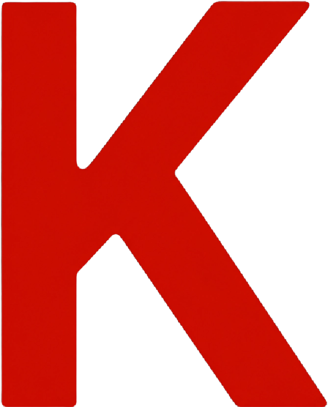

<div align="center">
    <h1 style="display: flex; justify-content: center;">
        <picture>
            
        </picture>
        evinS
    </h1>

  <p>
    Front End Developer focado em transformar ideias em experiências digitais modernas, funcionais e responsivas.
  </p>
</div>

<div align="center">
    
    
    
    
    
    
</div>

---

# 📖 Sobre o Projeto

Este projeto consiste no desenvolvimento do meu portfólio pessoal como desenvolvedor Front End, criado com foco em performance, design moderno e interatividade.

O objetivo do projeto é apresentar minhas habilidades, serviços, projetos e tecnologias de forma visualmente atrativa e profissional, reforçando minha identidade como desenvolvedor focado em UI/UX e desenvolvimento web moderno.

---

# 🌐 Acesse o Projeto

<p align="left">
  <a href="https://kevin-s.vercel.app/" target="_blank">
    
  </a>
</p>

---

# ✨ Funcionalidades

- 🌙 Tema Light/Dark
- 🎨 Interface moderna e responsiva
- ⚡ Animações fluidas com Framer Motion
- 🧩 Componentização reutilizável
- 📱 Responsividade para dispositivos móveis
- 🔴 Elementos 3D utilizando Three.js
- 🚀 Alta performance com Vite

---

# 🚀 Como Rodar o Projeto

## Clone o repositório

```bash
git clone https://github.com/kevin-simoes/kevinS.git
```

## Entre na pasta

```bash
cd kevinS
```

## Instale as dependências

```bash
npm install
```

## Rode o projeto

```bash
npm run dev
```
